# Data report overview

The tidy dataset was derived from the original [Human Activity Recognition Using Smartphones Data Set](http://archive.ics.uci.edu/ml/datasets/Human+Activity+Recognition+Using+Smartphones) by merging the training and test sets, extracting only the measurements on the mean and standard deviation for each measurement and averaging of each variable for each activity and each subject.

The dataset examined has the following dimensions:

---------------------------------
Feature                    Result
------------------------ --------
Number of observations        180

Number of variables            68
---------------------------------

## Naming convations:

The features selected for this database come from the accelerometer and gyroscope 3-axial raw signals (so with the suffix '-X' we denote the x-axis, with '-Y' the y-axis and with '-Z' the z-axis). 

These time domain signals (prefix 'Time-') were captured at a constant rate of 50 Hz. Then they were filtered using a median filter and a 3rd order low pass Butterworth filter with a corner frequency of 20 Hz to remove noise. Similarly, the acceleration signal was then separated into body and gravity acceleration signals ('Time-BodyAcceleration' and 'Time-GravityAcceleration' prefixes) using another low pass Butterworth filter with a corner frequency of 0.3 Hz. 

Subsequently, the body linear acceleration and angular velocity were derived in time to obtain Jerk signals (we denote this signals with '-Jerk'). Also the magnitude of these three-dimensional signals were calculated using the Euclidean norm (we denote this signals with 'Magnitude'). 

Finally a Fast Fourier Transform (FFT) was applied to some of these signals producing frequency domain signals (prefix 'Frequency-').

The set of variables that were estimated from these signals are:

mean(): Mean value (denoted with '-Mean')

std(): Standard deviation (denoted with '-Std')

## Codebook summary table

----------------------------------------------------------------------------------------------------------
Label   Variable                                              Class       # unique  Missing  Description  
                                                                            values                        
------- ----------------------------------------------------- --------- ---------- --------- -------------
        **[SubjectID]**                                       factor            30  0.00 %      The ID of the subject          

        **[Activity]**                                        factor             6  0.00 %      Type of activity          

        **[Time-BodyAcceleration-Mean-X]**                    numeric          180  0.00 %                

        **[Time-BodyAcceleration-Mean-Y]**                    numeric          180  0.00 %                

        **[Time-BodyAcceleration-Mean-Z]**                    numeric          180  0.00 %                

        **[Time-BodyAcceleration-Std-X]**                     numeric          180  0.00 %                

        **[Time-BodyAcceleration-Std-Y]**                     numeric          180  0.00 %                

        **[Time-BodyAcceleration-Std-Z]**                     numeric          180  0.00 %                

        **[Time-GravityAcceleration-Mean-X]**                 numeric          180  0.00 %                

        **[Time-GravityAcceleration-Mean-Y]**                 numeric          180  0.00 %                

        **[Time-GravityAcceleration-Mean-Z]**                 numeric          180  0.00 %                

        **[Time-GravityAcceleration-Std-X]**                  numeric          180  0.00 %                

        **[Time-GravityAcceleration-Std-Y]**                  numeric          180  0.00 %                

        **[Time-GravityAcceleration-Std-Z]**                  numeric          180  0.00 %                

        **[Time-BodyAcceleration-Jerk-Mean-X]**               numeric          180  0.00 %                

        **[Time-BodyAcceleration-Jerk-Mean-Y]**               numeric          180  0.00 %                

        **[Time-BodyAcceleration-Jerk-Mean-Z]**               numeric          180  0.00 %                

        **[Time-BodyAcceleration-Jerk-Std-X]**                numeric          180  0.00 %                

        **[Time-BodyAcceleration-Jerk-Std-Y]**                numeric          180  0.00 %                

        **[Time-BodyAcceleration-Jerk-Std-Z]**                numeric          180  0.00 %                

        **[Time-BodyGyroscope-Mean-X]**                       numeric          180  0.00 %                

        **[Time-BodyGyroscope-Mean-Y]**                       numeric          180  0.00 %                

        **[Time-BodyGyroscope-Mean-Z]**                       numeric          180  0.00 %                

        **[Time-BodyGyroscope-Std-X]**                        numeric          180  0.00 %                

        **[Time-BodyGyroscope-Std-Y]**                        numeric          180  0.00 %                

        **[Time-BodyGyroscope-Std-Z]**                        numeric          180  0.00 %                

        **[Time-BodyGyroscope-Jerk-Mean-X]**                  numeric          180  0.00 %                

        **[Time-BodyGyroscope-Jerk-Mean-Y]**                  numeric          180  0.00 %                

        **[Time-BodyGyroscope-Jerk-Mean-Z]**                  numeric          180  0.00 %                

        **[Time-BodyGyroscope-Jerk-Std-X]**                   numeric          180  0.00 %                

        **[Time-BodyGyroscope-Jerk-Std-Y]**                   numeric          180  0.00 %                

        **[Time-BodyGyroscope-Jerk-Std-Z]**                   numeric          180  0.00 %                

        **[Time-BodyAccelerationMagnitude-Mean]**             numeric          180  0.00 %                

        **[Time-BodyAccelerationMagnitude-Std]**              numeric          180  0.00 %                

        **[Time-GravityAccelerationMagnitude-Mean]**          numeric          180  0.00 %                

        **[Time-GravityAccelerationMagnitude-Std]**           numeric          180  0.00 %                

        **[Time-BodyAcceleration-JerkMagnitude-Mean]**        numeric          180  0.00 %                

        **[Time-BodyAcceleration-JerkMagnitude-Std]**         numeric          180  0.00 %                

        **[Time-BodyGyroscopeMagnitude-Mean]**                numeric          180  0.00 %                

        **[Time-BodyGyroscopeMagnitude-Std]**                 numeric          180  0.00 %                

        **[Time-BodyGyroscope-JerkMagnitude-Mean]**           numeric          180  0.00 %                

        **[Time-BodyGyroscope-JerkMagnitude-Std]**            numeric          180  0.00 %                

        **[Frequency-BodyAcceleration-Mean-X]**               numeric          180  0.00 %                

        **[Frequency-BodyAcceleration-Mean-Y]**               numeric          180  0.00 %                

        **[Frequency-BodyAcceleration-Mean-Z]**               numeric          180  0.00 %                

        **[Frequency-BodyAcceleration-Std-X]**                numeric          180  0.00 %                

        **[Frequency-BodyAcceleration-Std-Y]**                numeric          180  0.00 %                

        **[Frequency-BodyAcceleration-Std-Z]**                numeric          180  0.00 %                

        **[Frequency-BodyAcceleration-Jerk-Mean-X]**          numeric          180  0.00 %                

        **[Frequency-BodyAcceleration-Jerk-Mean-Y]**          numeric          180  0.00 %                

        **[Frequency-BodyAcceleration-Jerk-Mean-Z]**          numeric          180  0.00 %                

        **[Frequency-BodyAcceleration-Jerk-Std-X]**           numeric          180  0.00 %                

        **[Frequency-BodyAcceleration-Jerk-Std-Y]**           numeric          180  0.00 %                

        **[Frequency-BodyAcceleration-Jerk-Std-Z]**           numeric          180  0.00 %                

        **[Frequency-BodyGyroscope-Mean-X]**                  numeric          180  0.00 %                

        **[Frequency-BodyGyroscope-Mean-Y]**                  numeric          180  0.00 %                

        **[Frequency-BodyGyroscope-Mean-Z]**                  numeric          180  0.00 %                

        **[Frequency-BodyGyroscope-Std-X]**                   numeric          180  0.00 %                

        **[Frequency-BodyGyroscope-Std-Y]**                   numeric          180  0.00 %                

        **[Frequency-BodyGyroscope-Std-Z]**                   numeric          180  0.00 %                

        **[Frequency-BodyAccelerationMagnitude-Mean]**        numeric          180  0.00 %                

        **[Frequency-BodyAccelerationMagnitude-Std]**         numeric          180  0.00 %                

        **[Frequency-BodyAcceleration-JerkMagnitude-Mean]**   numeric          180  0.00 %                

        **[Frequency-BodyAcceleration-JerkMagnitude-Std]**    numeric          180  0.00 %                

        **[Frequency-BodyGyroscopeMagnitude-Mean]**           numeric          180  0.00 %                

        **[Frequency-BodyGyroscopeMagnitude-Std]**            numeric          180  0.00 %                

        **[Frequency-BodyGyroscope-JerkMagnitude-Mean]**      numeric          180  0.00 %                

        **[Frequency-BodyGyroscope-JerkMagnitude-Std]**       numeric          180  0.00 %                
----------------------------------------------------------------------------------------------------------

# Variable list
## SubjectID

-----------------------------------
Feature                      Result
------------------------- ---------
Variable type                factor

Number of missing obs.      0 (0 %)

Number of unique values          30

Mode                            "1"

Reference category                1
-----------------------------------

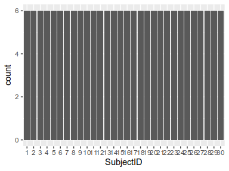<!-- -->

- Observed factor levels: \"1\", \"10\", \"11\", \"12\", \"13\", \"14\", \"15\", \"16\", \"17\", \"18\", \"19\", \"2\", \"20\", \"21\", \"22\", \"23\", \"24\", \"25\", \"26\", \"27\", \"28\", \"29\", \"3\", \"30\", \"4\", \"5\", \"6\", \"7\", \"8\", \"9\". 

---

## Activity

------------------------------------
Feature                       Result
------------------------- ----------
Variable type                 factor

Number of missing obs.       0 (0 %)

Number of unique values            6

Mode                        "LAYING"

Reference category            LAYING
------------------------------------

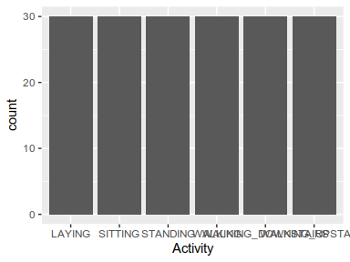<!-- -->

- Observed factor levels: \"LAYING\", \"SITTING\", \"STANDING\", \"WALKING\", \"WALKING_DOWNSTAIRS\", \"WALKING_UPSTAIRS\". 

---

## Time-BodyAcceleration-Mean-X

--------------------------------------
Feature                         Result
------------------------- ------------
Variable type                  numeric

Number of missing obs.         0 (0 %)

Number of unique values            180

Median                            0.28

1st and 3rd quartiles       0.27; 0.28

Min. and max.                0.22; 0.3
--------------------------------------

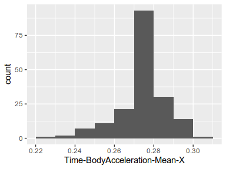<!-- -->

---

## Time-BodyAcceleration-Mean-Y

----------------------------------------
Feature                           Result
------------------------- --------------
Variable type                    numeric

Number of missing obs.           0 (0 %)

Number of unique values              180

Median                             -0.02

1st and 3rd quartiles       -0.02; -0.01

Min. and max.                   -0.04; 0
----------------------------------------

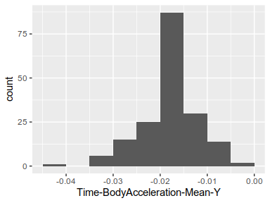<!-- -->

---

## Time-BodyAcceleration-Mean-Z

----------------------------------------
Feature                           Result
------------------------- --------------
Variable type                    numeric

Number of missing obs.           0 (0 %)

Number of unique values              180

Median                             -0.11

1st and 3rd quartiles        -0.11; -0.1

Min. and max.               -0.15; -0.08
----------------------------------------

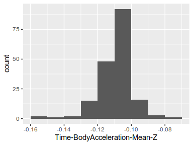<!-- -->

---

## Time-BodyAcceleration-Std-X

---------------------------------------
Feature                          Result
------------------------- -------------
Variable type                   numeric

Number of missing obs.          0 (0 %)

Number of unique values             180

Median                            -0.75

1st and 3rd quartiles       -0.98; -0.2

Min. and max.                  -1; 0.63
---------------------------------------

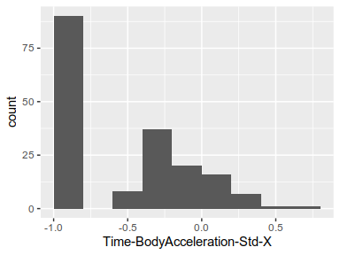<!-- -->

---

## Time-BodyAcceleration-Std-Y

----------------------------------------
Feature                           Result
------------------------- --------------
Variable type                    numeric

Number of missing obs.           0 (0 %)

Number of unique values              180

Median                             -0.51

1st and 3rd quartiles       -0.94; -0.03

Min. and max.                -0.99; 0.62
----------------------------------------

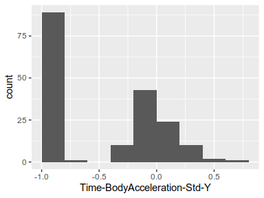<!-- -->

---

## Time-BodyAcceleration-Std-Z

----------------------------------------
Feature                           Result
------------------------- --------------
Variable type                    numeric

Number of missing obs.           0 (0 %)

Number of unique values              180

Median                             -0.65

1st and 3rd quartiles       -0.95; -0.23

Min. and max.                -0.99; 0.61
----------------------------------------

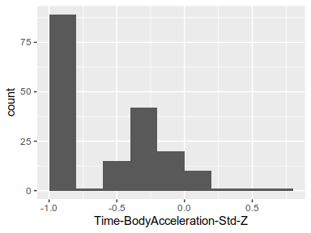<!-- -->

---

## Time-GravityAcceleration-Mean-X

---------------------------------------
Feature                          Result
------------------------- -------------
Variable type                   numeric

Number of missing obs.          0 (0 %)

Number of unique values             180

Median                             0.92

1st and 3rd quartiles        0.84; 0.94

Min. and max.               -0.68; 0.97
---------------------------------------

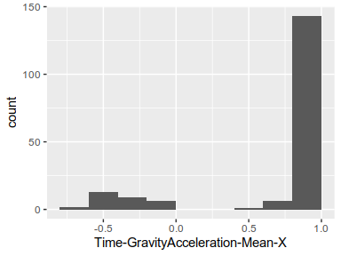<!-- -->

---

## Time-GravityAcceleration-Mean-Y

---------------------------------------
Feature                          Result
------------------------- -------------
Variable type                   numeric

Number of missing obs.          0 (0 %)

Number of unique values             180

Median                            -0.13

1st and 3rd quartiles       -0.23; 0.09

Min. and max.               -0.48; 0.96
---------------------------------------

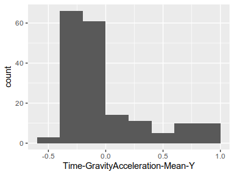<!-- -->

---

## Time-GravityAcceleration-Mean-Z

---------------------------------------
Feature                          Result
------------------------- -------------
Variable type                   numeric

Number of missing obs.          0 (0 %)

Number of unique values             180

Median                             0.02

1st and 3rd quartiles       -0.12; 0.15

Min. and max.                -0.5; 0.96
---------------------------------------

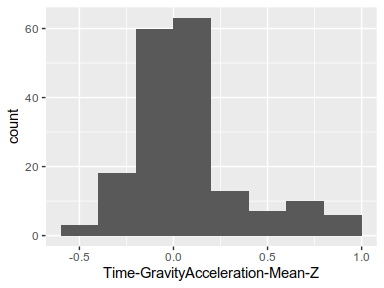<!-- -->

---

## Time-GravityAcceleration-Std-X

----------------------------------------
Feature                           Result
------------------------- --------------
Variable type                    numeric

Number of missing obs.           0 (0 %)

Number of unique values              180

Median                             -0.97

1st and 3rd quartiles       -0.98; -0.95

Min. and max.                  -1; -0.83
----------------------------------------

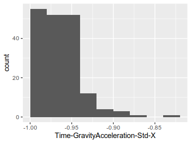<!-- -->

---

## Time-GravityAcceleration-Std-Y

----------------------------------------
Feature                           Result
------------------------- --------------
Variable type                    numeric

Number of missing obs.           0 (0 %)

Number of unique values              180

Median                             -0.96

1st and 3rd quartiles       -0.97; -0.94

Min. and max.               -0.99; -0.64
----------------------------------------

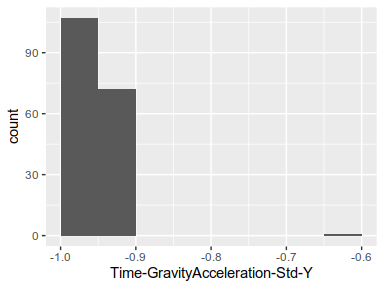<!-- -->

---

## Time-GravityAcceleration-Std-Z

----------------------------------------
Feature                           Result
------------------------- --------------
Variable type                    numeric

Number of missing obs.           0 (0 %)

Number of unique values              180

Median                             -0.95

1st and 3rd quartiles       -0.96; -0.92

Min. and max.               -0.99; -0.61
----------------------------------------

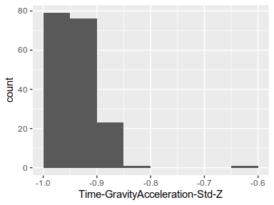<!-- -->

---

## Time-BodyAcceleration-Jerk-Mean-X

--------------------------------------
Feature                         Result
------------------------- ------------
Variable type                  numeric

Number of missing obs.         0 (0 %)

Number of unique values            180

Median                            0.08

1st and 3rd quartiles       0.07; 0.08

Min. and max.               0.04; 0.13
--------------------------------------

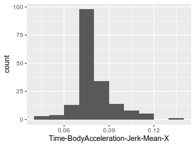<!-- -->

---

## Time-BodyAcceleration-Jerk-Mean-Y

---------------------------------------
Feature                          Result
------------------------- -------------
Variable type                   numeric

Number of missing obs.          0 (0 %)

Number of unique values             180

Median                             0.01

1st and 3rd quartiles           0; 0.01

Min. and max.               -0.04; 0.06
---------------------------------------

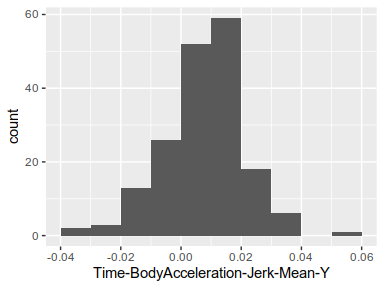<!-- -->

---

## Time-BodyAcceleration-Jerk-Mean-Z

---------------------------------------
Feature                          Result
------------------------- -------------
Variable type                   numeric

Number of missing obs.          0 (0 %)

Number of unique values             180

Median                                0

1st and 3rd quartiles          -0.01; 0

Min. and max.               -0.07; 0.04
---------------------------------------

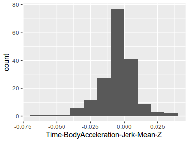<!-- -->

---

## Time-BodyAcceleration-Jerk-Std-X

----------------------------------------
Feature                           Result
------------------------- --------------
Variable type                    numeric

Number of missing obs.           0 (0 %)

Number of unique values              180

Median                             -0.81

1st and 3rd quartiles       -0.98; -0.22

Min. and max.                -0.99; 0.54
----------------------------------------

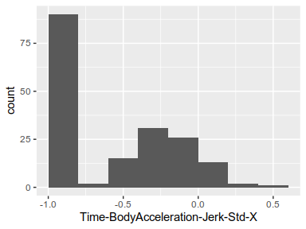<!-- -->

---

## Time-BodyAcceleration-Jerk-Std-Y

----------------------------------------
Feature                           Result
------------------------- --------------
Variable type                    numeric

Number of missing obs.           0 (0 %)

Number of unique values              180

Median                             -0.78

1st and 3rd quartiles       -0.97; -0.15

Min. and max.                -0.99; 0.36
----------------------------------------

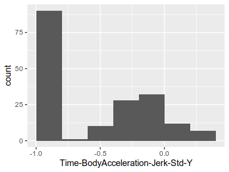<!-- -->

---

## Time-BodyAcceleration-Jerk-Std-Z

----------------------------------------
Feature                           Result
------------------------- --------------
Variable type                    numeric

Number of missing obs.           0 (0 %)

Number of unique values              180

Median                             -0.88

1st and 3rd quartiles       -0.98; -0.51

Min. and max.                -0.99; 0.03
----------------------------------------

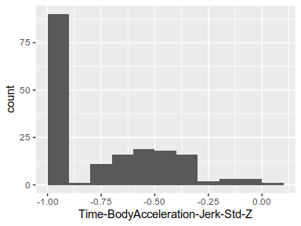<!-- -->

---

## Time-BodyGyroscope-Mean-X

----------------------------------------
Feature                           Result
------------------------- --------------
Variable type                    numeric

Number of missing obs.           0 (0 %)

Number of unique values              180

Median                             -0.03

1st and 3rd quartiles       -0.05; -0.02

Min. and max.                -0.21; 0.19
----------------------------------------

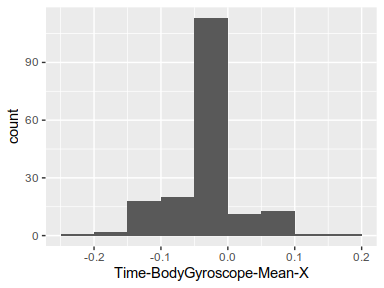<!-- -->

---

## Time-BodyGyroscope-Mean-Y

----------------------------------------
Feature                           Result
------------------------- --------------
Variable type                    numeric

Number of missing obs.           0 (0 %)

Number of unique values              180

Median                             -0.07

1st and 3rd quartiles       -0.09; -0.06

Min. and max.                 -0.2; 0.03
----------------------------------------

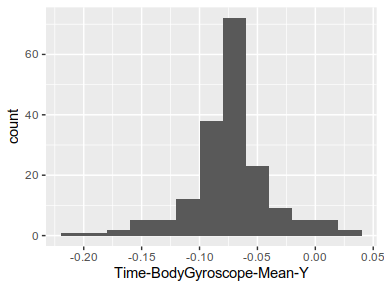<!-- -->

---

## Time-BodyGyroscope-Mean-Z

---------------------------------------
Feature                          Result
------------------------- -------------
Variable type                   numeric

Number of missing obs.          0 (0 %)

Number of unique values             180

Median                             0.09

1st and 3rd quartiles         0.07; 0.1

Min. and max.               -0.07; 0.18
---------------------------------------

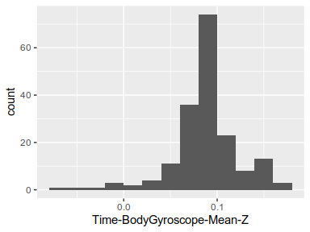<!-- -->

---

## Time-BodyGyroscope-Std-X

----------------------------------------
Feature                           Result
------------------------- --------------
Variable type                    numeric

Number of missing obs.           0 (0 %)

Number of unique values              180

Median                             -0.79

1st and 3rd quartiles       -0.97; -0.44

Min. and max.                -0.99; 0.27
----------------------------------------

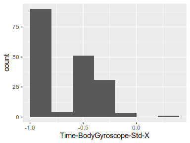<!-- -->

---

## Time-BodyGyroscope-Std-Y

----------------------------------------
Feature                           Result
------------------------- --------------
Variable type                    numeric

Number of missing obs.           0 (0 %)

Number of unique values              180

Median                              -0.8

1st and 3rd quartiles       -0.96; -0.42

Min. and max.                -0.99; 0.48
----------------------------------------

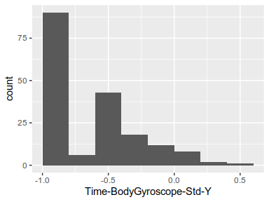<!-- -->

---

## Time-BodyGyroscope-Std-Z

----------------------------------------
Feature                           Result
------------------------- --------------
Variable type                    numeric

Number of missing obs.           0 (0 %)

Number of unique values              180

Median                              -0.8

1st and 3rd quartiles       -0.96; -0.31

Min. and max.                -0.99; 0.56
----------------------------------------

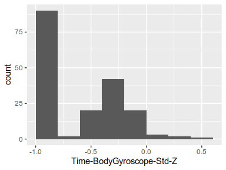<!-- -->

---

## Time-BodyGyroscope-Jerk-Mean-X

----------------------------------------
Feature                           Result
------------------------- --------------
Variable type                    numeric

Number of missing obs.           0 (0 %)

Number of unique values              180

Median                              -0.1

1st and 3rd quartiles        -0.1; -0.09

Min. and max.               -0.16; -0.02
----------------------------------------

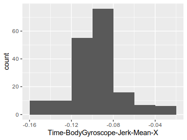<!-- -->

---

## Time-BodyGyroscope-Jerk-Mean-Y

----------------------------------------
Feature                           Result
------------------------- --------------
Variable type                    numeric

Number of missing obs.           0 (0 %)

Number of unique values              180

Median                             -0.04

1st and 3rd quartiles       -0.05; -0.04

Min. and max.               -0.08; -0.01
----------------------------------------

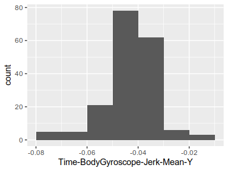<!-- -->

---

## Time-BodyGyroscope-Jerk-Mean-Z

----------------------------------------
Feature                           Result
------------------------- --------------
Variable type                    numeric

Number of missing obs.           0 (0 %)

Number of unique values              180

Median                             -0.05

1st and 3rd quartiles       -0.06; -0.05

Min. and max.               -0.09; -0.01
----------------------------------------

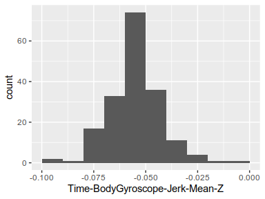<!-- -->

---

## Time-BodyGyroscope-Jerk-Std-X

----------------------------------------
Feature                           Result
------------------------- --------------
Variable type                    numeric

Number of missing obs.           0 (0 %)

Number of unique values              180

Median                             -0.84

1st and 3rd quartiles       -0.98; -0.46

Min. and max.                   -1; 0.18
----------------------------------------

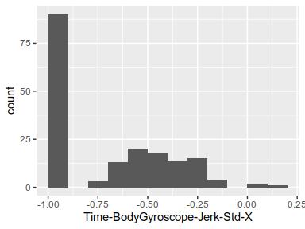<!-- -->

---

## Time-BodyGyroscope-Jerk-Std-Y

----------------------------------------
Feature                           Result
------------------------- --------------
Variable type                    numeric

Number of missing obs.           0 (0 %)

Number of unique values              180

Median                             -0.89

1st and 3rd quartiles       -0.98; -0.59

Min. and max.                    -1; 0.3
----------------------------------------

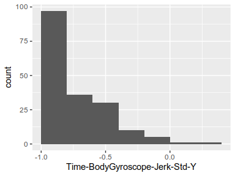<!-- -->

---

## Time-BodyGyroscope-Jerk-Std-Z

----------------------------------------
Feature                           Result
------------------------- --------------
Variable type                    numeric

Number of missing obs.           0 (0 %)

Number of unique values              180

Median                             -0.86

1st and 3rd quartiles       -0.98; -0.47

Min. and max.                   -1; 0.19
----------------------------------------

<!-- -->

---

## Time-BodyAccelerationMagnitude-Mean

----------------------------------------
Feature                           Result
------------------------- --------------
Variable type                    numeric

Number of missing obs.           0 (0 %)

Number of unique values              180

Median                             -0.48

1st and 3rd quartiles       -0.96; -0.09

Min. and max.                -0.99; 0.64
----------------------------------------

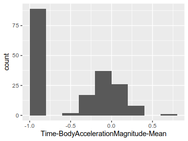<!-- -->

---

## Time-BodyAccelerationMagnitude-Std

----------------------------------------
Feature                           Result
------------------------- --------------
Variable type                    numeric

Number of missing obs.           0 (0 %)

Number of unique values              180

Median                             -0.61

1st and 3rd quartiles       -0.94; -0.21

Min. and max.                -0.99; 0.43
----------------------------------------

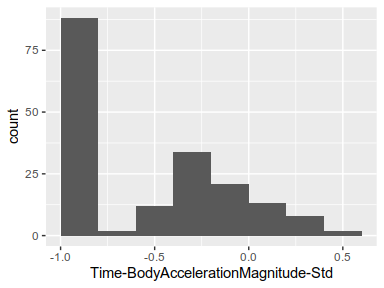<!-- -->

---

## Time-GravityAccelerationMagnitude-Mean

----------------------------------------
Feature                           Result
------------------------- --------------
Variable type                    numeric

Number of missing obs.           0 (0 %)

Number of unique values              180

Median                             -0.48

1st and 3rd quartiles       -0.96; -0.09

Min. and max.                -0.99; 0.64
----------------------------------------

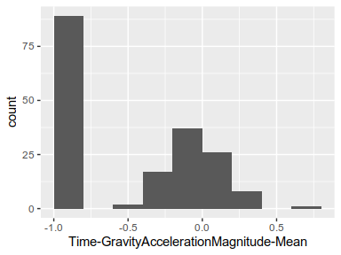<!-- -->

---

## Time-GravityAccelerationMagnitude-Std

----------------------------------------
Feature                           Result
------------------------- --------------
Variable type                    numeric

Number of missing obs.           0 (0 %)

Number of unique values              180

Median                             -0.61

1st and 3rd quartiles       -0.94; -0.21

Min. and max.                -0.99; 0.43
----------------------------------------

<!-- -->

---

## Time-BodyAcceleration-JerkMagnitude-Mean

----------------------------------------
Feature                           Result
------------------------- --------------
Variable type                    numeric

Number of missing obs.           0 (0 %)

Number of unique values              180

Median                             -0.82

1st and 3rd quartiles       -0.98; -0.25

Min. and max.                -0.99; 0.43
----------------------------------------

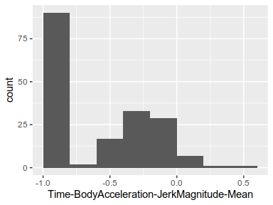<!-- -->

---

## Time-BodyAcceleration-JerkMagnitude-Std

----------------------------------------
Feature                           Result
------------------------- --------------
Variable type                    numeric

Number of missing obs.           0 (0 %)

Number of unique values              180

Median                              -0.8

1st and 3rd quartiles       -0.98; -0.22

Min. and max.                -0.99; 0.45
----------------------------------------

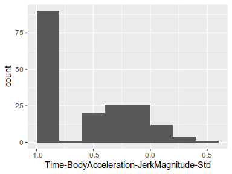<!-- -->

---

## Time-BodyGyroscopeMagnitude-Mean

----------------------------------------
Feature                           Result
------------------------- --------------
Variable type                    numeric

Number of missing obs.           0 (0 %)

Number of unique values              180

Median                             -0.66

1st and 3rd quartiles       -0.95; -0.22

Min. and max.                -0.98; 0.42
----------------------------------------

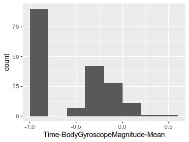<!-- -->

---

## Time-BodyGyroscopeMagnitude-Std

----------------------------------------
Feature                           Result
------------------------- --------------
Variable type                    numeric

Number of missing obs.           0 (0 %)

Number of unique values              180

Median                             -0.74

1st and 3rd quartiles       -0.95; -0.36

Min. and max.                 -0.98; 0.3
----------------------------------------

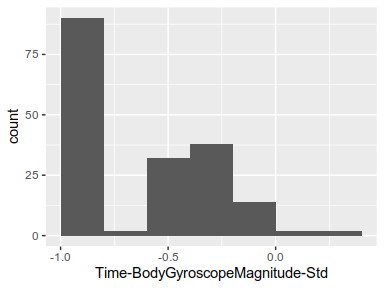<!-- -->

---

## Time-BodyGyroscope-JerkMagnitude-Mean

----------------------------------------
Feature                           Result
------------------------- --------------
Variable type                    numeric

Number of missing obs.           0 (0 %)

Number of unique values              180

Median                             -0.86

1st and 3rd quartiles       -0.99; -0.51

Min. and max.                   -1; 0.09
----------------------------------------

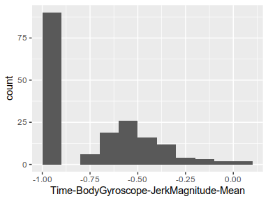<!-- -->

---

## Time-BodyGyroscope-JerkMagnitude-Std

----------------------------------------
Feature                           Result
------------------------- --------------
Variable type                    numeric

Number of missing obs.           0 (0 %)

Number of unique values              180

Median                             -0.88

1st and 3rd quartiles       -0.98; -0.58

Min. and max.                   -1; 0.25
----------------------------------------

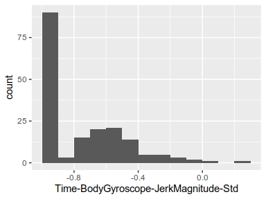<!-- -->

---

## Frequency-BodyAcceleration-Mean-X

----------------------------------------
Feature                           Result
------------------------- --------------
Variable type                    numeric

Number of missing obs.           0 (0 %)

Number of unique values              180

Median                             -0.77

1st and 3rd quartiles       -0.98; -0.22

Min. and max.                   -1; 0.54
----------------------------------------

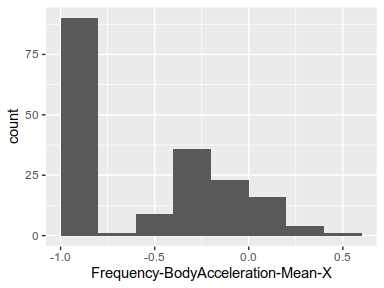<!-- -->

---

## Frequency-BodyAcceleration-Mean-Y

----------------------------------------
Feature                           Result
------------------------- --------------
Variable type                    numeric

Number of missing obs.           0 (0 %)

Number of unique values              180

Median                             -0.59

1st and 3rd quartiles       -0.95; -0.06

Min. and max.                -0.99; 0.52
----------------------------------------

<!-- -->

---

## Frequency-BodyAcceleration-Mean-Z

----------------------------------------
Feature                           Result
------------------------- --------------
Variable type                    numeric

Number of missing obs.           0 (0 %)

Number of unique values              180

Median                             -0.72

1st and 3rd quartiles       -0.96; -0.32

Min. and max.                -0.99; 0.28
----------------------------------------

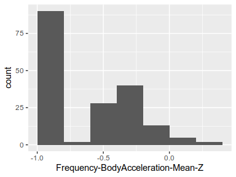<!-- -->

---

## Frequency-BodyAcceleration-Std-X

---------------------------------------
Feature                          Result
------------------------- -------------
Variable type                   numeric

Number of missing obs.          0 (0 %)

Number of unique values             180

Median                            -0.75

1st and 3rd quartiles       -0.98; -0.2

Min. and max.                  -1; 0.66
---------------------------------------

<!-- -->

---

## Frequency-BodyAcceleration-Std-Y

----------------------------------------
Feature                           Result
------------------------- --------------
Variable type                    numeric

Number of missing obs.           0 (0 %)

Number of unique values              180

Median                             -0.51

1st and 3rd quartiles       -0.94; -0.08

Min. and max.                -0.99; 0.56
----------------------------------------

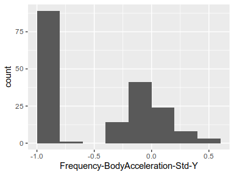<!-- -->

---

## Frequency-BodyAcceleration-Std-Z

----------------------------------------
Feature                           Result
------------------------- --------------
Variable type                    numeric

Number of missing obs.           0 (0 %)

Number of unique values              180

Median                             -0.64

1st and 3rd quartiles       -0.95; -0.27

Min. and max.                -0.99; 0.69
----------------------------------------

<!-- -->

---

## Frequency-BodyAcceleration-Jerk-Mean-X

----------------------------------------
Feature                           Result
------------------------- --------------
Variable type                    numeric

Number of missing obs.           0 (0 %)

Number of unique values              180

Median                             -0.81

1st and 3rd quartiles       -0.98; -0.28

Min. and max.                -0.99; 0.47
----------------------------------------

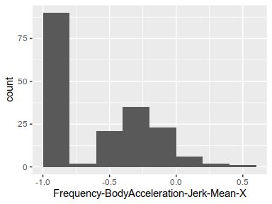<!-- -->

---

## Frequency-BodyAcceleration-Jerk-Mean-Y

---------------------------------------
Feature                          Result
------------------------- -------------
Variable type                   numeric

Number of missing obs.          0 (0 %)

Number of unique values             180

Median                            -0.78

1st and 3rd quartiles       -0.97; -0.2

Min. and max.               -0.99; 0.28
---------------------------------------

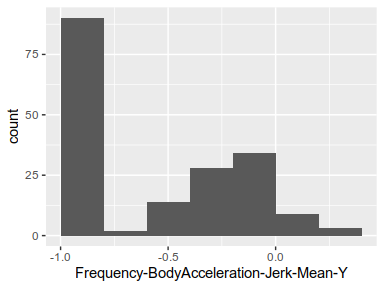<!-- -->

---

## Frequency-BodyAcceleration-Jerk-Mean-Z

----------------------------------------
Feature                           Result
------------------------- --------------
Variable type                    numeric

Number of missing obs.           0 (0 %)

Number of unique values              180

Median                             -0.87

1st and 3rd quartiles       -0.98; -0.47

Min. and max.                -0.99; 0.16
----------------------------------------

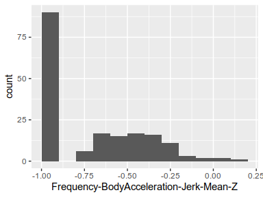<!-- -->

---

## Frequency-BodyAcceleration-Jerk-Std-X

----------------------------------------
Feature                           Result
------------------------- --------------
Variable type                    numeric

Number of missing obs.           0 (0 %)

Number of unique values              180

Median                             -0.83

1st and 3rd quartiles       -0.98; -0.25

Min. and max.                   -1; 0.48
----------------------------------------

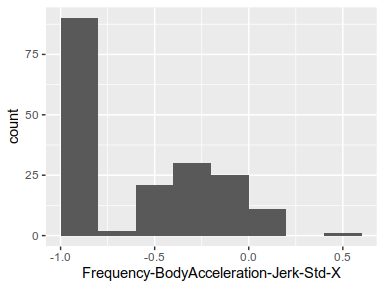<!-- -->

---

## Frequency-BodyAcceleration-Jerk-Std-Y

----------------------------------------
Feature                           Result
------------------------- --------------
Variable type                    numeric

Number of missing obs.           0 (0 %)

Number of unique values              180

Median                             -0.79

1st and 3rd quartiles       -0.97; -0.17

Min. and max.                -0.99; 0.35
----------------------------------------

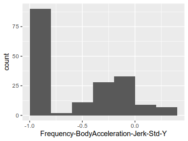<!-- -->

---

## Frequency-BodyAcceleration-Jerk-Std-Z

----------------------------------------
Feature                           Result
------------------------- --------------
Variable type                    numeric

Number of missing obs.           0 (0 %)

Number of unique values              180

Median                              -0.9

1st and 3rd quartiles       -0.98; -0.54

Min. and max.               -0.99; -0.01
----------------------------------------

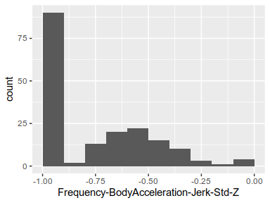<!-- -->

---

## Frequency-BodyGyroscope-Mean-X

----------------------------------------
Feature                           Result
------------------------- --------------
Variable type                    numeric

Number of missing obs.           0 (0 %)

Number of unique values              180

Median                             -0.73

1st and 3rd quartiles       -0.97; -0.34

Min. and max.                -0.99; 0.47
----------------------------------------

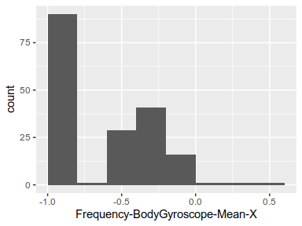<!-- -->

---

## Frequency-BodyGyroscope-Mean-Y

----------------------------------------
Feature                           Result
------------------------- --------------
Variable type                    numeric

Number of missing obs.           0 (0 %)

Number of unique values              180

Median                             -0.81

1st and 3rd quartiles       -0.97; -0.45

Min. and max.                -0.99; 0.33
----------------------------------------

<!-- -->

---

## Frequency-BodyGyroscope-Mean-Z

----------------------------------------
Feature                           Result
------------------------- --------------
Variable type                    numeric

Number of missing obs.           0 (0 %)

Number of unique values              180

Median                             -0.79

1st and 3rd quartiles       -0.96; -0.26

Min. and max.                -0.99; 0.49
----------------------------------------

<!-- -->

---

## Frequency-BodyGyroscope-Std-X

----------------------------------------
Feature                           Result
------------------------- --------------
Variable type                    numeric

Number of missing obs.           0 (0 %)

Number of unique values              180

Median                             -0.81

1st and 3rd quartiles       -0.98; -0.48

Min. and max.                 -0.99; 0.2
----------------------------------------

<!-- -->

---

## Frequency-BodyGyroscope-Std-Y

----------------------------------------
Feature                           Result
------------------------- --------------
Variable type                    numeric

Number of missing obs.           0 (0 %)

Number of unique values              180

Median                              -0.8

1st and 3rd quartiles       -0.96; -0.42

Min. and max.                -0.99; 0.65
----------------------------------------

<!-- -->

---

## Frequency-BodyGyroscope-Std-Z

----------------------------------------
Feature                           Result
------------------------- --------------
Variable type                    numeric

Number of missing obs.           0 (0 %)

Number of unique values              180

Median                             -0.82

1st and 3rd quartiles       -0.96; -0.39

Min. and max.                -0.99; 0.52
----------------------------------------

<!-- -->

---

## Frequency-BodyAccelerationMagnitude-Mean

----------------------------------------
Feature                           Result
------------------------- --------------
Variable type                    numeric

Number of missing obs.           0 (0 %)

Number of unique values              180

Median                             -0.67

1st and 3rd quartiles       -0.96; -0.16

Min. and max.                -0.99; 0.59
----------------------------------------

<!-- -->

---

## Frequency-BodyAccelerationMagnitude-Std

----------------------------------------
Feature                           Result
------------------------- --------------
Variable type                    numeric

Number of missing obs.           0 (0 %)

Number of unique values              180

Median                             -0.65

1st and 3rd quartiles       -0.95; -0.37

Min. and max.                -0.99; 0.18
----------------------------------------

<!-- -->

---

## Frequency-BodyAcceleration-JerkMagnitude-Mean

----------------------------------------
Feature                           Result
------------------------- --------------
Variable type                    numeric

Number of missing obs.           0 (0 %)

Number of unique values              180

Median                             -0.79

1st and 3rd quartiles       -0.98; -0.19

Min. and max.                -0.99; 0.54
----------------------------------------

<!-- -->

---

## Frequency-BodyAcceleration-JerkMagnitude-Std

----------------------------------------
Feature                           Result
------------------------- --------------
Variable type                    numeric

Number of missing obs.           0 (0 %)

Number of unique values              180

Median                             -0.81

1st and 3rd quartiles       -0.98; -0.27

Min. and max.                -0.99; 0.32
----------------------------------------

<!-- -->

---

## Frequency-BodyGyroscopeMagnitude-Mean

----------------------------------------
Feature                           Result
------------------------- --------------
Variable type                    numeric

Number of missing obs.           0 (0 %)

Number of unique values              180

Median                             -0.77

1st and 3rd quartiles       -0.96; -0.41

Min. and max.                 -0.99; 0.2
----------------------------------------

<!-- -->

---

## Frequency-BodyGyroscopeMagnitude-Std

----------------------------------------
Feature                           Result
------------------------- --------------
Variable type                    numeric

Number of missing obs.           0 (0 %)

Number of unique values              180

Median                             -0.77

1st and 3rd quartiles       -0.95; -0.43

Min. and max.                -0.98; 0.24
----------------------------------------

<!-- -->

---

## Frequency-BodyGyroscope-JerkMagnitude-Mean

----------------------------------------
Feature                           Result
------------------------- --------------
Variable type                    numeric

Number of missing obs.           0 (0 %)

Number of unique values              180

Median                             -0.88

1st and 3rd quartiles       -0.98; -0.58

Min. and max.                   -1; 0.15
----------------------------------------

<!-- -->

---

## Frequency-BodyGyroscope-JerkMagnitude-Std

----------------------------------------
Feature                           Result
------------------------- --------------
Variable type                    numeric

Number of missing obs.           0 (0 %)

Number of unique values              180

Median                             -0.89

1st and 3rd quartiles       -0.98; -0.61

Min. and max.                   -1; 0.29
----------------------------------------

<!-- -->

---

Report generation information:

 *  Created by: Christos Tsolkas.

 *  Report creation time: Sat Oct 17 2020 14:39:01

 *  Report was run from directory: `~/Human-Activity-Recognition`

 *  dataMaid v1.4.0 [Pkg: 2019-12-10 from CRAN (R 3.6.3)]

 *  R version 3.6.3 (2020-02-29).

 *  Platform: x86_64-pc-linux-gnu (64-bit)(Ubuntu 18.04.5 LTS).

 *  Function call: `dataMaid::makeDataReport(data = tidy_dataset, output = "html", 
    render = FALSE, mode = c("summarize", "visualize", "check"
    ), smartNum = FALSE, file = "codebook_tidy_dataset.Rmd", 
    replace = TRUE, checks = list(character = "showAllFactorLevels", 
        factor = "showAllFactorLevels", labelled = "showAllFactorLevels", 
        haven_labelled = "showAllFactorLevels", numeric = NULL, 
        integer = NULL, logical = NULL, Date = NULL), listChecks = FALSE, 
    maxProbVals = Inf, codebook = TRUE, reportTitle = "Codebook for the tidy dataset from the Human Activity Recognition Using Smartphones Data Set")`

